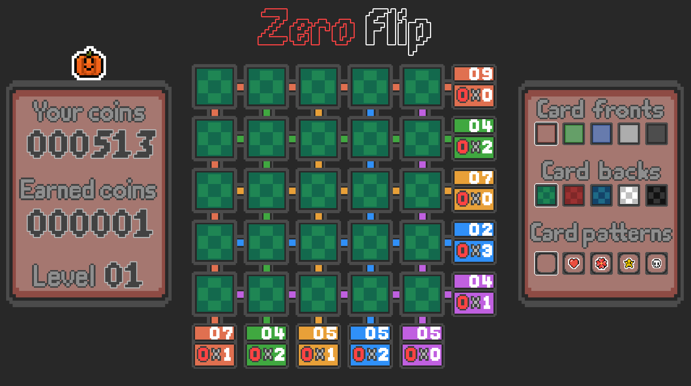

# Zero Flip

### General Info

This game is a clone of the mini-game "Voltorb Flip" from Pokémon Heartgold/Soulsilver coded in C++ using the SFML library.

<br>

## Preview



<br>

## How to build

Call ```make``` in the project directory. Make and g++ must be installed.
